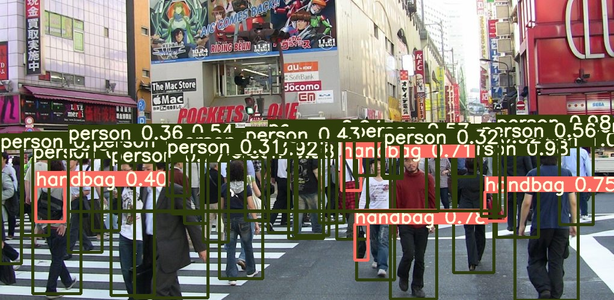
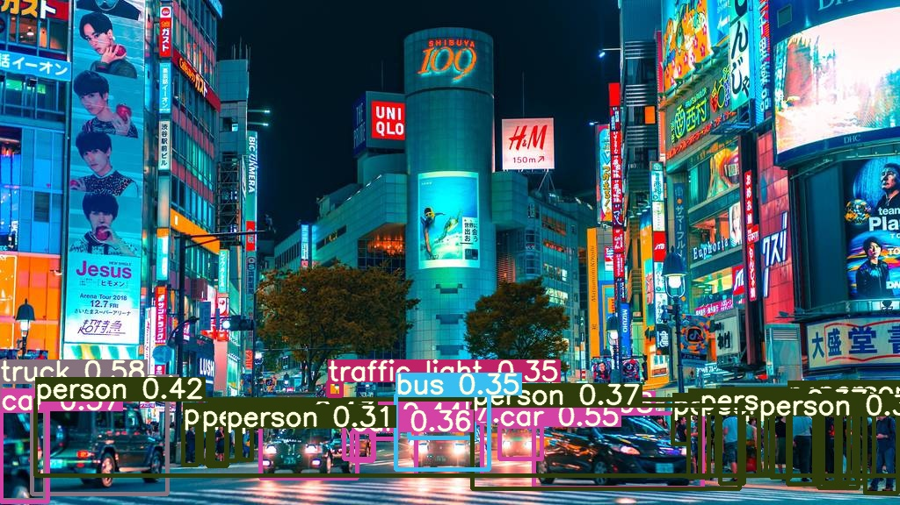

# YoloV3の勉強用のソースコード

## 自分でお試し出来るソフト
exe化されたプログラム　－＞　[Google Drive](https://drive.google.com/open?id=1cXLo9twMmtSFcnaA2PNDt9O-n5GFiChw)

## イントロ
メインコードはpytorch-yolo-denaです。主にそれを分解しました。

ほかの二つは（darknetとyolov3-ultralytics）参照や補足としても読みました。

## YoloV3のアーキテクチャ

特徴抽出をするための新しいネットワークはDarknet-53とresidual networkです． ピンクのCNNブロックでショートカットコネクションを使っていて，ネットワークは著しく大きくなった． このネットワークは53個のconvolutional layersを持つのでDarknet-53と呼ぶんだ．
3層の予想ブロックがあります。それらは　(13x13)ブロック、(26x26)ブロック、(52x52)ブロックです。
それぞれ３レベルのdownsamplingネットワークからアウトプットを集めて、予想マトリクスを取ります

3つの予想ブロックからのアウトプットマトリクスを連結し、10467x85のマトリクスをNon Maximum Suppresionアルゴリズムで、バウンディングボックスを計算します

## アウトプットの例

### Tokyo Bon 東京盆踊り2020 (MakuDonarudo) Namewee 黃明志 ft.Cool Japan TV @亞洲通吃2018專輯 All Eat Asia
下の動画はTokyo Bonの動画で物体検出を行った結果です。クリックすると、youtubeへ移動します

### 東京の景色1

### 東京の景色2

